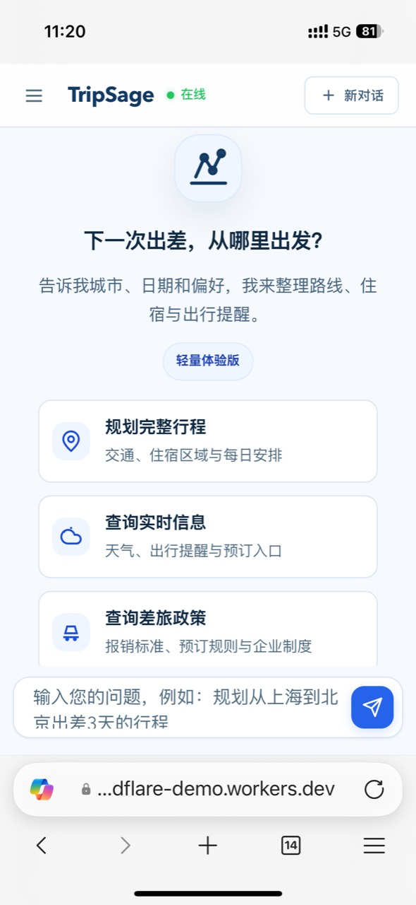
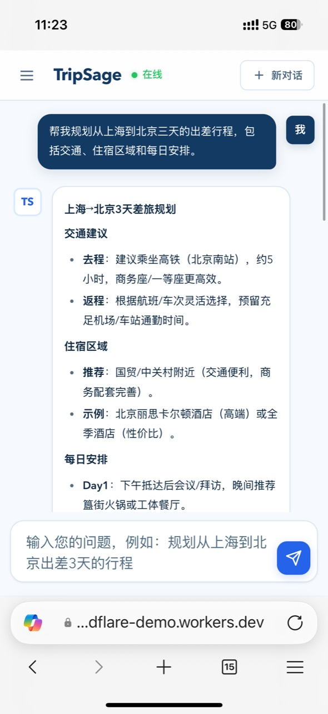
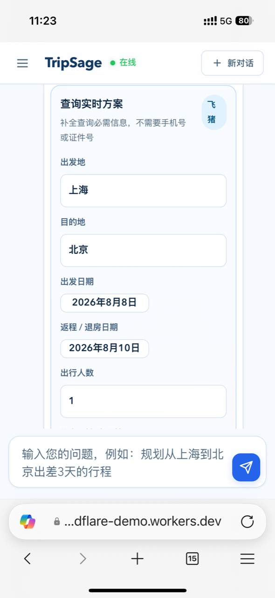
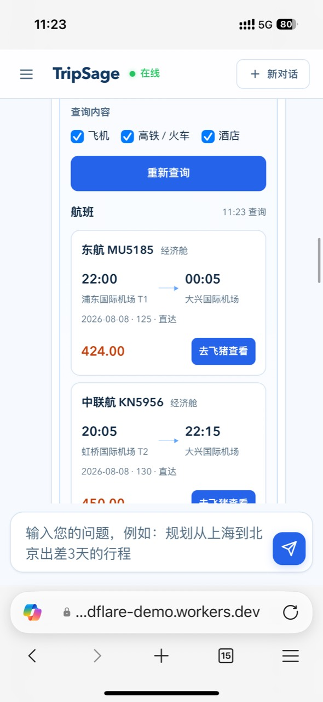
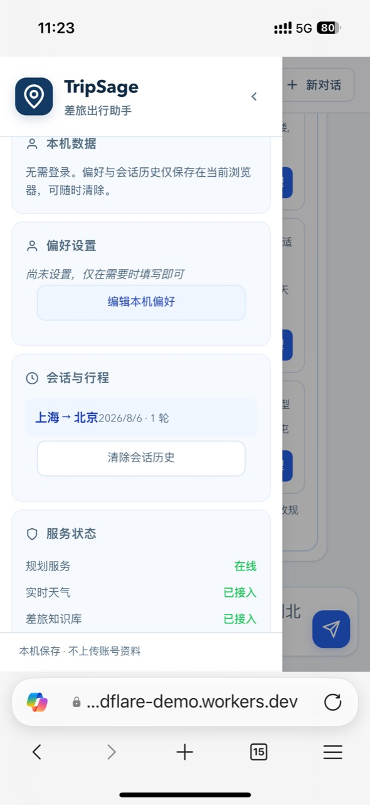
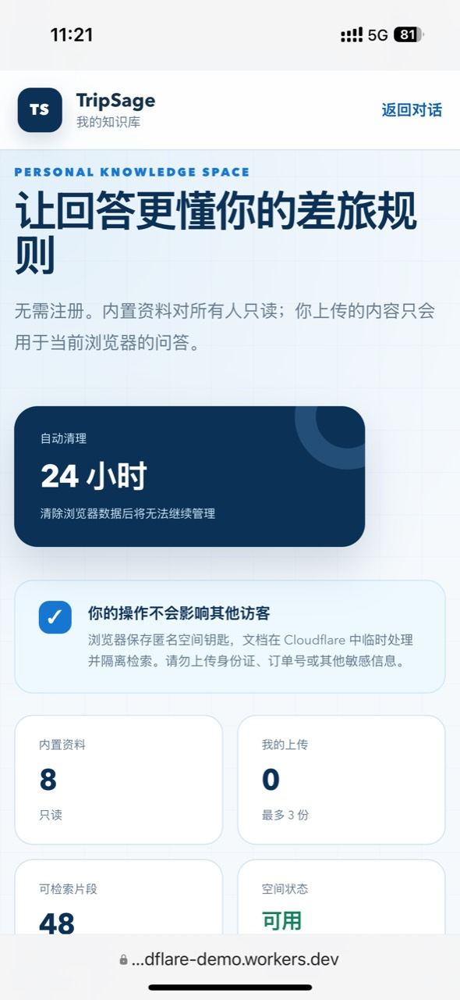

# TripSage 差旅出行助手

面向个人与小团队的智能差旅助手。用一次对话完成行程规划、实时天气查询、机酒高铁方案查询和企业差旅知识问答。

**在线体验（国内网络通常需 VPN）：** [https://tripsage.tripsage-cloudflare-demo.workers.dev](https://tripsage.tripsage-cloudflare-demo.workers.dev)

<!-- 演示视频补录后放在此处 -->

> 当前线上版本是轻量体验版，适合功能演示和少量试用。查询结果仅供行程决策参考，实际价格、库存及退改规则以供应商页面为准。

## 界面预览

以下截图展示移动端轻量体验版的主要使用流程。

<table>
  <tr>
    <td align="center" width="33%">
      <br>
      <sub><b>首页</b><br>从行程规划、实时信息或差旅政策开始</sub>
    </td>
    <td align="center" width="33%">
      <br>
      <sub><b>行程规划</b><br>通过对话生成交通、住宿与每日安排</sub>
    </td>
    <td align="center" width="33%">
      <br>
      <sub><b>实时查询</b><br>补充路线、日期、人数和查询类型</sub>
    </td>
  </tr>
  <tr>
    <td align="center" width="33%">
      <br>
      <sub><b>方案比较</b><br>查看实时交通方案并跳转供应商</sub>
    </td>
    <td align="center" width="33%">
      <br>
      <sub><b>偏好与历史</b><br>在当前浏览器保存偏好、会话与行程</sub>
    </td>
    <td align="center" width="33%">
      <br>
      <sub><b>个人知识空间</b><br>隔离检索当前浏览器上传的差旅资料</sub>
    </td>
  </tr>
</table>

## 产品背景与目标

TripSage 聚焦个体商旅用户的出差前规划：用户通常需要在交通、酒店、天气和企业制度之间反复切换，还要在每次出差时重新说明预算与偏好。项目的目标不是替代 OTA 完成交易，而是把分散信息整理为一份可比较、可追溯、可继续修改的差旅方案。

| 用户问题 | 产品判断 | 对应方案 | 验证指标 |
|---|---|---|---|
| 跨平台查询和整理耗时 | 先解决信息密度最高的出差前规划 | 对话式收集需求，聚合行程、天气与实时出行信息 | 完整方案生成耗时、任务完成率 |
| 每次出差重复输入偏好 | 高频偏好应在后续会话中自动复用 | 在浏览器本地保存偏好、会话和历史行程 | 偏好记忆准确率、历史偏好命中率 |
| 企业制度难查且回答缺少依据 | 差旅建议必须能说明规则来源 | 使用 RAG 检索政策、报销和预订资料并展示出处 | 知识问答正确率、来源一致率 |
| 复合需求容易漏项 | 单轮生成前应先拆解任务和依赖关系 | 由意图识别与编排层调度 5 类业务 Agent | 意图识别准确率、必要模块完整率 |

### 核心场景与优先级

| 优先级 | 场景 | 取舍依据 |
|---|---|---|
| P0 | 完整差旅行程规划 | 覆盖交通、住宿和每日安排，是用户价值最集中的主流程 |
| P0 | 企业差旅知识问答 | 直接影响方案是否符合标准及能否报销，优先保证可信度 |
| P1 | 天气、机票、高铁和酒店查询 | 补足决策所需的时效信息，但不在站内完成交易 |
| P1 | 偏好与历史行程复用 | 降低重复输入成本，验证跨会话个性化价值 |
| P2 | 个人知识空间 | 用轻量上传验证个人或小团队资料接入需求，不扩展为企业权限系统 |

### 关键产品取舍

- **以出差前规划为核心**：暂不覆盖审批、支付和售后，把资源集中在信息整合与决策支持。
- **多 Agent 负责拆解，统一界面负责体验**：用户只需描述目标，系统在内部完成意图识别、资料检索、工具调用和结果聚合。
- **RAG 回答必须展示来源**：政策类问题优先保证可核对性，资料不足时不补写不存在的制度。
- **轻量版不强制注册**：偏好和会话保存在当前浏览器，降低 Demo 体验门槛；代价是不支持跨设备同步。
- **查询后跳转供应商**：实时信息用于比较和筛选，预订与支付仍在供应商页面完成。
- **外部服务必须可降级**：AI 或实时接口不可用时返回知识检索结果或官方查询入口，避免整条主流程失效。

## 核心能力

- **完整行程规划**：结合出发地、目的地、日期和偏好，生成交通、住宿区域与每日安排。
- **实时出行信息**：查询 Open-Meteo 天气，以及飞猪机票、酒店和高铁方案。
- **企业差旅知识库**：通过 RAG 检索差旅标准、报销规定、预订指南和应急流程，并展示资料来源。
- **个人知识空间**：无需账号即可上传 TXT、Markdown 或 CSV 文档；当前浏览器只能检索自己的临时资料。
- **本机会话历史**：在浏览器中保存偏好、近期会话和行程，点击记录可恢复完整对话。
- **预订跳转**：将已识别的城市、日期和人数带入查询流程，并提供供应商跳转入口。

## 评测方法与迭代

项目围绕“生成效率、回答可信度、偏好复用”建立离线评测与用户体验两层验证。公开评测集依据项目历史口径重新整理，用于展示评测方法和支持后续版本回归，不等同于开发阶段的原始测试数据。

### 1000 条公开评测集

| 模块 | 数量 | 主要检查项 |
|---|---:|---|
| 意图识别与实体提取 | 400 | 主意图、Agent 调度、城市/日期/时长等实体 |
| 差旅政策 RAG 问答 | 250 | 资料命中、关键概念、回答依据和来源标注 |
| 偏好与会话记忆 | 150 | 偏好新增、覆盖、查询和后续复用 |
| 行程规划 | 120 | 必要模块、约束满足和方案完整性 |
| 实时工具调用 | 80 | 天气、航班、高铁、酒店工具选择及失败降级 |
| **合计** | **1000** | — |

数据根据 6 类核心意图、8 类差旅资料和常见出行约束组合生成，并按模块分层划分为 700 条开发集和 300 条保留测试集。开发集用于定位 Bad Case 和调整提示词、路由及规则；保留测试集只在版本冻结后运行，减少根据测试结果反复调参造成的指标失真。数据字段、生成脚本和校验方式见 [`evaluation/`](evaluation/README.md)。

### 指标口径

| 指标 | 判定方式 |
|---|---|
| 意图识别准确率 | 预测主意图与人工标签完全一致；复合任务同时检查必要 Agent 是否全部进入调度计划 |
| 实体提取准确率 | 对出发地、目的地、日期、时长和人数计算字段级正确率 |
| 知识问答正确率 | 检索资料、关键事实和来源标注均符合预期才计为正确 |
| 偏好记忆准确率 | 正确识别新增、覆盖或查询动作，并写入或读取正确的偏好类型和值 |
| 行程任务完成率 | 回答包含交通建议、住宿区域、每日安排和出行提醒，并满足用户明确约束 |
| 工具调用成功率 | 选择正确的天气或出行工具，参数完整；接口失败时能够给出安全降级入口 |

意图、实体和工具路由可以进行自动比对；RAG 回答与行程质量需要结合结构化规则和人工复核。复跑时应固定模型版本、提示词版本、温度等参数，并单独记录超时、接口失败和降级比例。

### 三轮迭代

| 阶段 | 主要 Bad Case | 迭代动作 | 验证重点 |
|---|---|---|---|
| 第一轮：建立基线 | 同义表达和口语输入容易误判，输出格式不稳定 | 明确 6 类意图边界，补充典型示例并约束结构化输出 | 单意图分类与基础实体提取 |
| 第二轮：覆盖复合任务 | “规划行程并比较交通”等请求容易漏掉子任务 | 增加查询改写、复合意图拆解和 Plan-and-Execute 依赖调度 | 多 Agent 召回和必要模块完整率 |
| 第三轮：提升可用性 | 上下文省略、偏好覆盖和外部接口失败影响连续体验 | 注入会话与偏好上下文，区分追加/覆盖动作，增加重试、降级与固定回归集 | 跨会话偏好复用、失败恢复和整体任务完成率 |

### 阶段性结果

以下结果来自项目开发阶段的内部离线评测与 50+ 名用户体验记录，用于比较迭代前后的相对变化。仓库中的公开评测集依据相同口径重新整理，便于复现评测方法，但不等同于当时的原始测试数据。模型版本、提示词和外部接口变化可能影响复跑结果，因此这些数据不作为线上服务 SLA。

| 评测维度 | 基线/对照 | 阶段性结果 | 结果口径 |
|---|---:|---:|---|
| 意图识别准确率 | 65% | 92% | 主意图完全匹配；复合任务同时检查必要 Agent 是否进入调度 |
| 知识库问答正确率 | 0%（未接入知识库） | 96% | 检索资料、关键事实和来源标注均正确才计为通过 |
| 偏好记忆准确率 | 0%（未提供持久化记忆） | 95% | 正确识别新增、覆盖或查询动作，并操作正确的偏好字段 |
| 完整行程生成耗时 | 传统规划约 2–3 小时 | 典型任务约 16 分钟 | 从首次输入到获得可继续采用的完整方案 |
| 历史偏好命中率 | 0%（未复用历史偏好） | 86% | 存在可复用偏好的行程中，系统无需重复询问便正确应用 |

其中三个 0% 是功能可用性基线：基线版本没有知识检索、持久化偏好或历史复用能力，并不表示通用模型在相关问题上的自然回答能力为零。该口径用于衡量新增产品能力是否形成完整闭环，避免将不可核对的模型常识回答计入企业知识问答结果。

### 50+ 用户体验测试

通过线上轻量版和本地完整版本邀请 50+ 名用户体验核心流程。测试任务覆盖三日跨城行程规划、飞机与高铁比较、差旅政策问答，以及保存偏好后的再次规划；同时记录从首次输入到获得可采用方案的时间、补充或修改轮次、是否重复输入偏好、任务是否完成，并收集开放式反馈。

用户测试主要用于发现离线数据难以覆盖的问题，例如用户不会按预设顺序补充信息、对“实时价格”的理解不同，以及行程虽然结构完整但缺少可执行细节。相关反馈被整理为 Bad Case，再进入下一轮提示词、交互或工具路由迭代。

### 评测边界

- 公开集由业务模板和组合条件生成，适合回归测试，但不能代表真实用户请求的自然分布。
- 行程“是否可采用”包含主观判断，需要保留人工复核，不能只依赖关键词计分。
- 模型版本和外部供应商接口会持续变化，单次结果不等同于线上长期 SLA。
- 用户体验测试用于验证个人项目的方向与可用性，不替代大规模对照实验或商业化验证。

## 两种运行版本

| 版本 | 适用场景 | 主要技术 | 数据保存 |
|---|---|---|---|
| `demo/` Cloudflare 轻量版 | 在线展示、短期试用 | Workers AI、Vectorize、KV、Open-Meteo、FlyAI | 偏好和会话保存在当前浏览器；个人知识文档临时保存在云端隔离空间 |
| Python 完整版 | 本地开发、Agent 编排研究 | AgentScope、FastAPI、ChromaDB、DeepSeek 兼容 API | 本地 JSON 记忆与 ChromaDB 知识库 |

## 在线轻量版架构

```text
浏览器
├─ 对话、偏好、行程历史 ─────────────── localStorage
├─ POST /api/chat ─────────────────── Workers AI
├─ POST /api/weather ──────────────── Open-Meteo
├─ POST /api/travel/search ────────── FlyAI / 飞猪
└─ /knowledge.html
   ├─ 文档原文与过期信息 ───────────── Cloudflare KV
   └─ 向量检索 ────────────────────── Cloudflare Vectorize
```

线上知识库包含 8 类示例资料：差旅标准、报销规定、预订指南、FAQ、应急指南、平台指南、城市指南和环保倡议。用户上传的个人资料通过浏览器生成的匿名空间标识隔离，并按设定时间自动清理。

## 部署 Cloudflare 轻量版

### 1. 安装依赖

```bash
cd demo
npm install
```

### 2. 创建 Cloudflare 资源

创建 Vectorize 索引和 KV Namespace，并将实际资源信息填写到 `demo/wrangler.jsonc`：

```bash
npx wrangler vectorize create tripsage-rag --dimensions=1024 --metric=cosine
npx wrangler kv namespace create RAG_STORE
```

### 3. 配置可选的实时供应商

天气使用 Open-Meteo，无需密钥。机票、酒店和高铁实时查询需要 FlyAI 凭证：

```bash
npx wrangler secret put FLYAI_API_KEY
npx wrangler secret put FLYAI_SIGN_SECRET
```

不要将任何真实凭证写入 `.env`、`wrangler.jsonc` 或提交到 Git。

未配置供应商凭证时，页面会安全降级为官方查询入口，不会展示未经验证的价格或库存。

### 4. 构建 RAG 资料

```bash
npm run rag:build
```

该命令会生成 `src/rag-data.generated.js` 和 `rag/kv-seed.generated.json`。部署到新的 Cloudflare 账户时，还需要使用 Workers AI 为分块生成向量，并将向量和文档元数据分别写入 Vectorize 与 KV；仓库目前不提供包含账户凭证的一键导入命令。

### 5. 检查与部署

```bash
npm test
npm run check
npm run deploy
```

## 启动 Python 完整版

### 1. 创建环境并安装依赖

```bash
python -m venv venv
source venv/Scripts/activate   # Windows Git Bash
pip install -r requirements.txt
```

PowerShell 可使用：

```powershell
.\venv\Scripts\Activate.ps1
```

### 2. 配置模型

根据自己的模型供应商修改 `config.py`。不要提交真实 API Key。

```python
LLM_CONFIG = {
    "api_key": "your-api-key",
    "model_name": "your-model",
    "base_url": "https://your-provider.example/v1",
    "temperature": 0.7,
    "max_tokens": 8192,
}
```

### 3. 初始化知识库

```bash
python .claude/skills/ask-question/script/init_knowledge_base.py
```

### 4. 启动 Web 或 CLI

```bash
uvicorn web.app:app --host 0.0.0.0 --port 8000
```

浏览器访问 `http://localhost:8000`。

```bash
python cli.py
```

## Python 多 Agent 设计

```text
用户输入
  → IntentionAgent：意图识别、实体提取、查询改写
  → OrchestrationAgent：按依赖关系调度任务
    ├─ MemoryQuery
    ├─ EventCollection
    ├─ Preference
    ├─ InformationQuery
    ├─ RAGKnowledge
    └─ ItineraryPlanning
  → 聚合回答并更新记忆
```

| Agent | 职责 |
|---|---|
| `IntentionAgent` | 识别规划、记忆、偏好、知识、信息查询和事项收集意图 |
| `OrchestrationAgent` | 并行执行无依赖任务，并按优先级组织结果 |
| `RAGKnowledgeAgent` | 检索差旅资料并提供来源 |
| `EventCollectionAgent` | 提取城市、日期、人数和出行目的 |
| `PreferenceAgent` | 维护交通、座席、住宿和预算偏好 |
| `InformationQueryAgent` | 查询天气与外部出行信息 |
| `ItineraryPlanningAgent` | 生成结构化差旅行程 |

## 项目结构

```text
TripSage/
├─ demo/                    # Cloudflare Workers 在线轻量版
│  ├─ public/              # 白蓝色响应式前端
│  ├─ rag/                 # 在线版示例知识资料
│  ├─ scripts/             # RAG 构建脚本
│  ├─ src/                 # Worker、FlyAI 与 RAG 接口
│  └─ tests/               # Worker 自动测试
├─ agents/                 # Python Agent 编排层
├─ context/                # 短期与长期记忆
├─ .claude/skills/         # Agent Skills 与本地 RAG
├─ evaluation/             # 1000 条公开评测集、生成与校验脚本
├─ web/                    # FastAPI Web 界面
├─ tests/                  # Python 测试
├─ cli.py                  # CLI 入口
├─ config.py               # 模型与系统配置
└─ requirements.txt
```

## 隐私与产品边界

- 轻量版不强制登录，不提供跨设备账号同步。
- 偏好、会话和行程历史默认保存在当前浏览器；清除浏览器数据后无法恢复。
- 匿名知识空间仅适合试用，不应上传身份证件、合同、财务明细等敏感资料。
- 预订和支付在供应商页面完成。
- 实时供应商能力取决于相应接口的可用性和额度，最终信息以供应商页面为准。

## 测试

公开评测集校验：

```bash
node evaluation/generate-dataset.mjs
node evaluation/validate-dataset.mjs
```

Cloudflare 轻量版：

```bash
cd demo
npm test
npm run check
```

Python 完整版：

```bash
python tests/test_memory_system.py
python tests/test_intention_agent.py
python tests/test_orchestration.py
python tests/test_rag_agent.py
python tests/test_cli_qa.py
```

## License

[MIT License](LICENSE)
